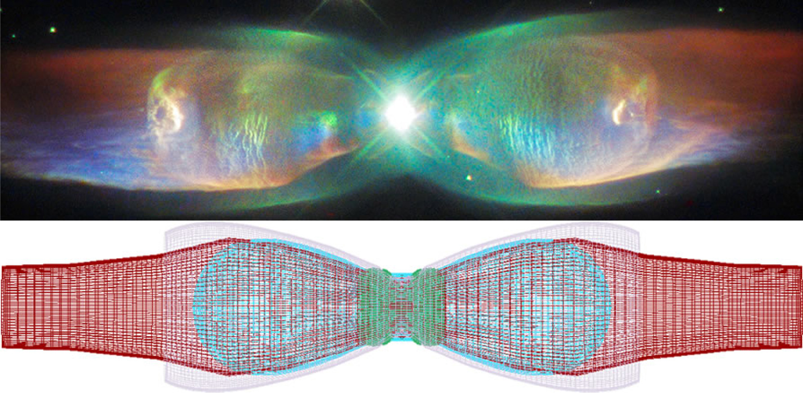
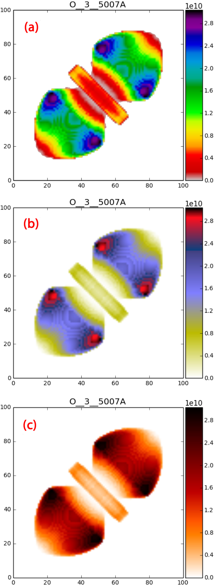
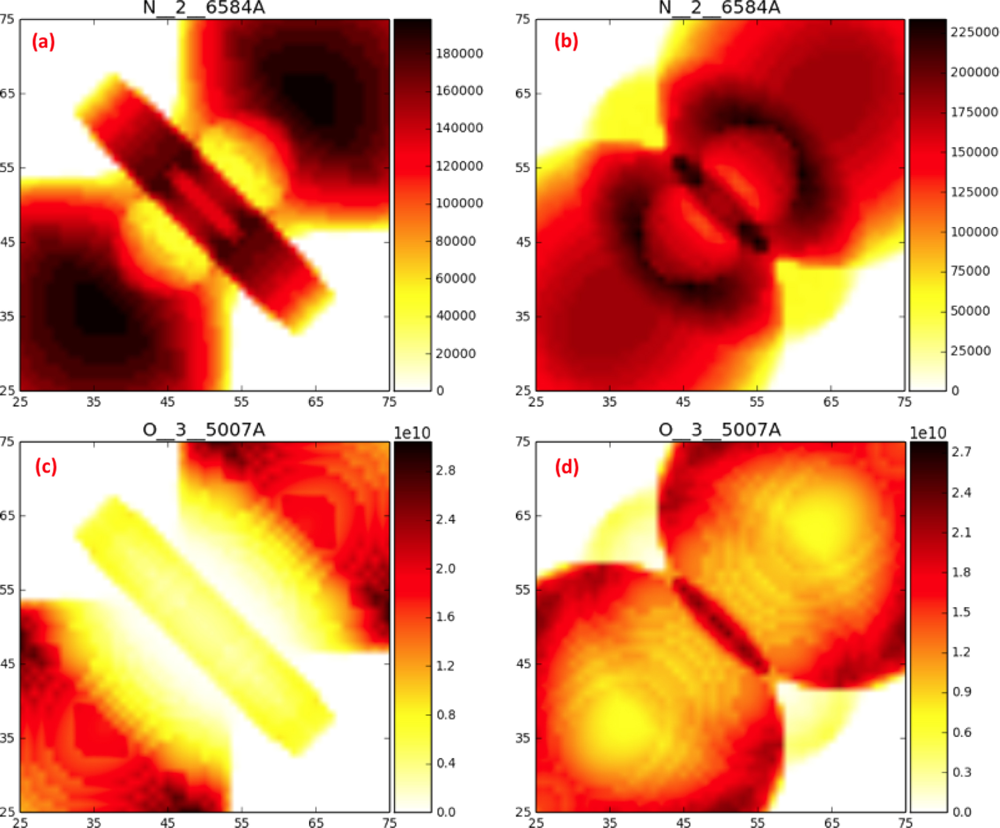
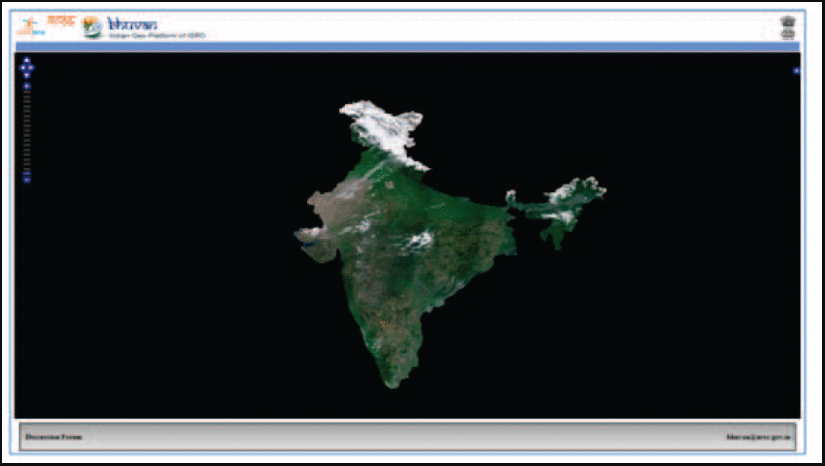
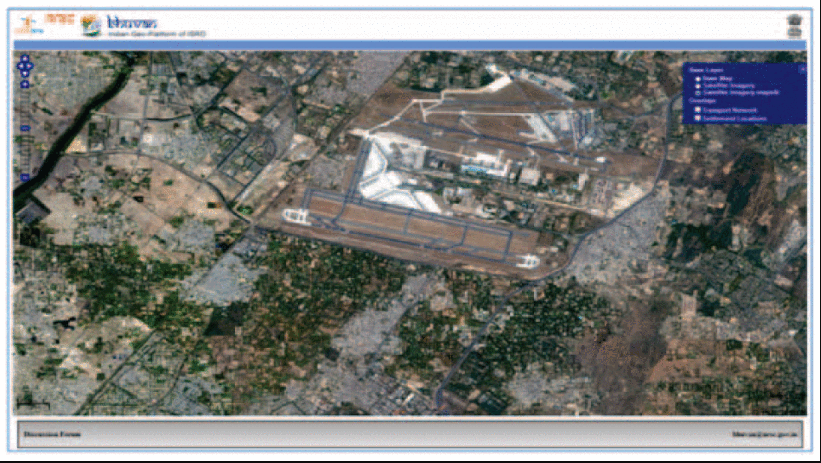
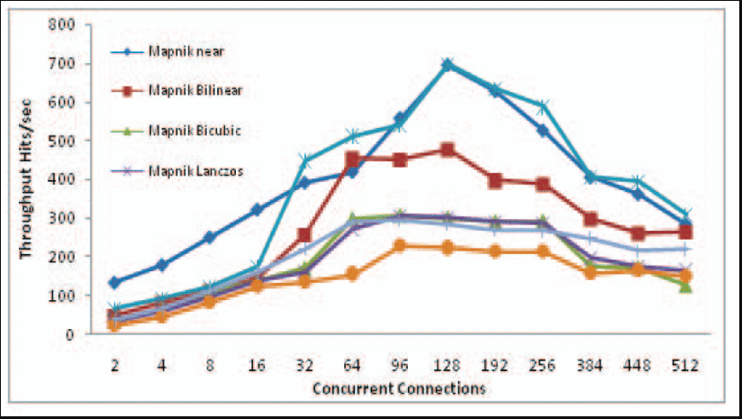

# Renderizado por Software

## Definición

El renderizado por software es el proceso de generar una imagen de un modelo por medio de cálculos computacionales en un programa informático.

En el contexto del renderizado de gráficos, el renderizado por software se refiere a un proceso de renderizado que no depende de los ASIC de hardware de gráficos, como una tarjeta gráfica. El renderizado tiene lugar enteramente en la CPU. Renderizar todo con la CPU (de propósito general) tiene la principal ventaja de que no está restringido a las capacidades (limitadas) del hardware de gráficos, pero la desventaja es que se necesitan más semiconductores para obtener la misma velocidad.

El renderizado se utiliza en arquitectura, simuladores, videojuegos, efectos visuales de cine y televisión y visualización de diseños. El renderizado es el último paso del proceso de animación y da el aspecto final a los modelos y a la animación con efectos visuales como el sombreado, el mapeado de texturas, las sombras, los reflejos y el desenfoque de movimiento. El renderizado puede dividirse en dos categorías principales: el renderizado en tiempo real (también conocido como renderizado en línea) y el pre-renderizado (también llamado renderizado fuera de línea). El renderizado en tiempo real se utiliza para renderizar una escena de forma interactiva, como en los videos juegos en 3D, y generalmente cada fotograma debe ser renderizado en unos pocos milisegundos. El renderizado fuera de línea se utiliza para crear imágenes y películas realistas, en las que cada fotograma puede tardar horas o días en completarse, o para la depuración de código gráfico complejo por parte de los programadores.

Fuente: [Software rendering](https://en.wikipedia.org/wiki/Software_rendering)

## Estado del arte

En los últimos años podemos apreciar que el uso de software de renderizado ha crecido ampliamente, impregnándose en todos los campos de la actividad humana, al estar está más correlacionada con el uso de computadores.

Los avances aquí presentados serán enfocados más a aplicaciones relacionadas con la astronomía.

### Introducing PyCross: PyCloudy Rendering Of Shape Software for pseudo 3D ionisation modelling of nebulae

Este artículo publicado en el año 2020 por K. Fitzgerald, E.J. Harvey, N. Keaveney, M.P. Redman a través del portal web de revistas científicas ScienceDirect trata un tema relevante para el entendimiento de la evolución estelar: La investigación de los procesos de las nebulosas foto ionizadas. 

Para este artículo, presentan el uso de PyCross: PyCloudy Rendering Of Shape Software, una aplicación de modelado pseudo 3D que genera modelos de foto ionización de nebulosas ópticamente delgadas, creados con el software Shape integrado. El cual podemos encontrar de forma gratuita en el [Github de PyCross](https://github.com/karolfitzgerald/PyCross_OSX_App).

Acá podemos apreciar una imagen generada por este software, consiste en 3 mapas de color de 71 posibles en donde se describe el modelo de emision 5007 de los datos prueba. Las barras de color corresponden a la temperatura efectiva de la fuente ionizada.

También podemos generar con esas mismas características estos modelos de foto ionización de las nebulosas [N II] 6584 A. En el artículo se exponen más modelos generados para estos cuerpos espaciales, utilizando dicho software y su integración.

Articulo retomado de este [link](https://www-sciencedirect-com.ezproxy.unal.edu.co/science/article/pii/S2213133720300366?via%3Dihub#fig3)

<!-- Aca va la imagen de la nebulosa ionizada del articulo -->

### Study of open source web map rendering software for rendering Bhuvan High Resolution Satellite data

Este artículo publicado en el año 2019 por A. R. Muppalla, N. Naresh, P. Aravinda Kumar, V. M. Bothale, A. K. Joshi and A. V. V. Prasad en el conferencia del 20 de octubre del 02219 de IEEE referente a avances recientes en geociencia y teledetección, muestra Bhuvan la plataforma geológica india de la ISRO.

Dicha plataforma alberga datos satelitales multitemporales, multisensoriales y multirresolución a través de Internet y se utiliza para diversas aplicaciones de teledetección.

En este caso el software de renderización de mapas de código abierto es Mapnik y MapServer, este es utilizado para mostrar datos satelitales como mosaicos de mapas en línea, esto en función del nivel del zoom, proyección y área de interés. 

#### Mapnik
Es un conjunto de herramientas de código abierto para la representación de mapas. Se trata de una biblioteca compartida en C++ que proporciona algoritmos y patrones para el acceso y la visualización de datos espaciales. Utiliza la librería de renderizado AGG (Anti Grain Geometry) y ofrece un renderizado antialiasing con una precisión inferior al píxel.

#### MapServer
Es un software de código abierto para la representación de mapas geográficos y es ampliamente utilizado para la navegación de datos SIG, crear mapas de imágenes geográficas que se pueden utilizar directamente a través de Internet. Está desarrollado en C y tiene características importantes como el soporte de plataformas cruzadas, interfaces de programación de aplicaciones (API) disponibles en PHP, Python, Perl, Ruby, Java y .NET

Articulo retomado de este [link](https://ieeexplore-ieee-org.ezproxy.unal.edu.co/document/8976042?arnumber=8976042)

## Posibles aplicaciones

Se ha presentado una nueva aplicación para la generación de modelos pseudo 3D de foto ionización de nebulosas de capa fina modeladas. El software fue desarrollado utilizando un ciclo de vida de desarrollo de software formal, escrito en Python y funcionará sin necesidad de instalar ningún entorno de desarrollo o paquetes adicionales de Python.

Por otra parte para el manejo de las imágenes satelitales, el método de remuestreo de Lanczos es conocido por ser óptimo para las imágenes manejadas en el campo de la teledetección. Este método permitió obtener imágenes de alta calidad sobre los demás implementados en Mapnik y MapServer.

